<h1 align="center">👋 Bienvenido/a a mi portafolio</h1>

  <strong>QA ENGINEER · QA MANUAL TESTER · QA DOCUMENTADOR · QA AUTOMATIZADOR JUNIOR</strong>

  
  

---

## 📋 Índice

1. [🚀 Sobre mí](#-sobre-mí)  
2. [🛠️ Tech Stack](#️-tech-stack)  
3. [📂 Proyectos Destacados](#-proyectos-destacados)  
4. [📄 CV Profesional](#-cv-profesional)  
5. [📬 ¿Hablemos?](#-hablemos)

---

## 🚀 Sobre mí

Soy un profesional con formación en Contabilidad, especializado en **Quality Assurance (QA)**. Combino habilidades técnicas en **pruebas manuales y automatizadas**, manejo de herramientas como **Selenium, Postman y JIRA**, y experiencia en documentación, SQL y análisis de datos.

Mi enfoque está en **mejorar la calidad del software**, colaborar con equipos ágiles y optimizar procesos con pensamiento crítico y proactividad.

---

Además, cuento con experiencia en:

- ✍️ **Redacción de planes de prueba**, **historias de usuario** y **casos de uso**.
- 🧪 **Diseño y ejecución de casos de prueba** funcionales y de regresión.
- 🐞 **Reporte de defectos** con análisis de severidad/prioridad en JIRA.
- 🧠 **Aplicación de técnicas de testing** como:
  - Partición de equivalencias
  - Análisis de valores límites
  - Tablas de decisión
  - Casos de uso
- 🔄 **Pruebas de APIs REST usando Postman**, ejecutando operaciones **CRUD**.
- 🗃️ **Gestión de bases de datos con MySQL**:
  - Creación de tablas y bases de datos
  - Inserción de registros y consultas SQL
    
---

## 🛠️ Tech Stack

  <!-- QA Tools -->
  
  
  
  

  <!-- Project Management -->
  
  
  
  

  <!-- DB / Data -->
  
  
  
  

  <!-- IA & Otros -->
  
  

---

## 📂 Proyectos Destacados

## 🛴 Urban.Scooter – Plataforma web y API para alquilar scooters
**Descripción:** Plataforma web y API para alquilar scooters (agregar más detalle).

**Resultados:** 
- Diseñé y ejecuté **54 casos de prueba** para validaciones de API.
- Realicé pruebas en **4 endpoints** (GET, POST, DELETE) usando **Postman**.
- Reporté **22 errores** en la API y front-end, documentados en **JIRA** con severidad y prioridad.
 
**Aptitudes:**

**Enlace:** [Repositorio GitHub](https://github.com/ArturoLopMan/urban-scooter)

**Capturas del proyecto:**  

  <a href="assets/img/urban_scooter_1.PNG" target="_blank">
    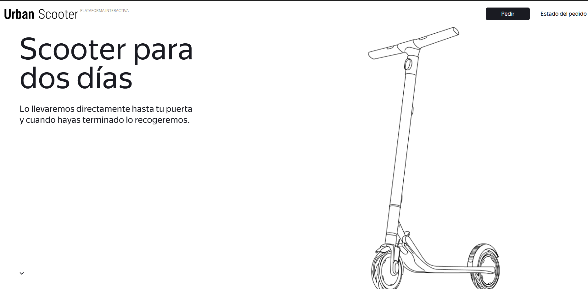
  </a>  

  <a href="assets/img/urban_scooter_2.PNG" target="_blank">
    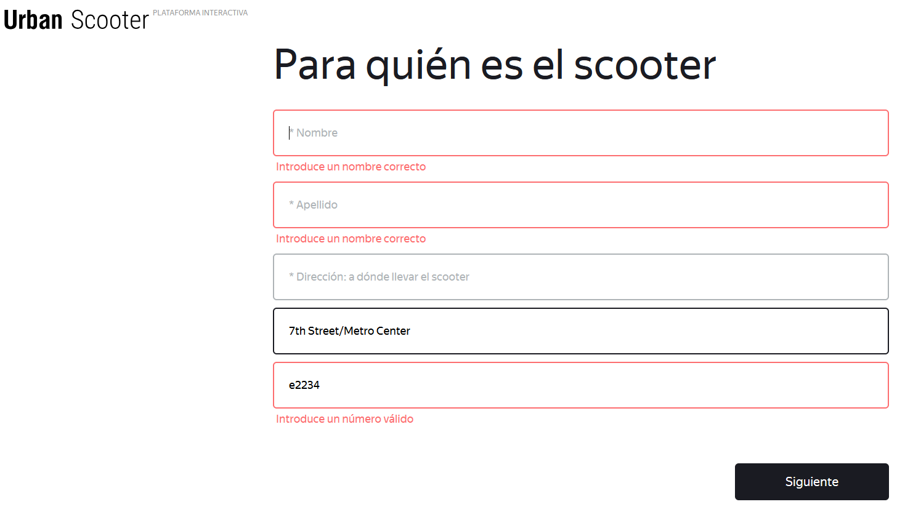
  </a>  

  <a href="assets/img/urban_scooter_informe.PNG" target="_blank">
    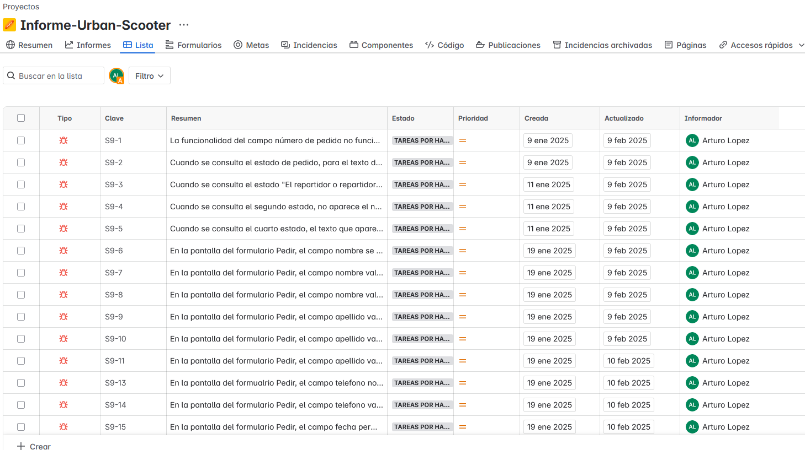
  </a>  

  <a href="assets/img/urban_scooter_informe_detalle.PNG" target="_blank">
    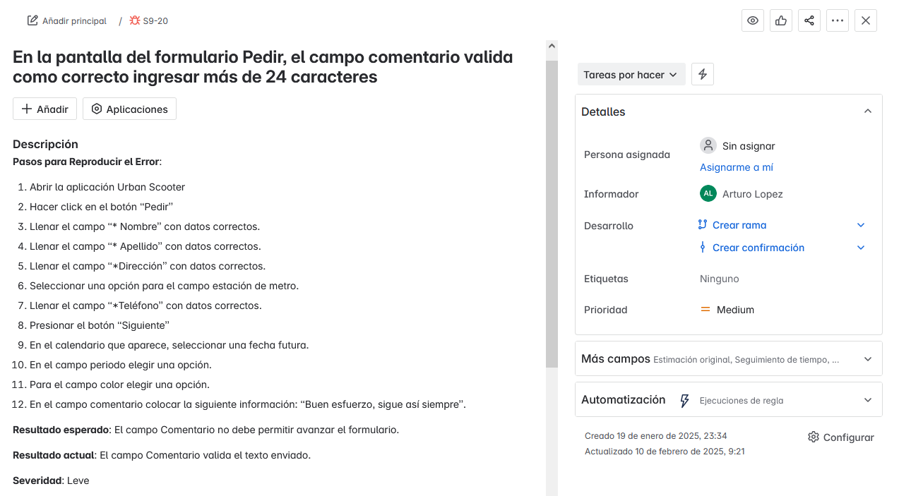
  </a>  

---

## 🍔 Urban.Lunch – Aplicación Android para pedir comida
**Descripción:** Aplicación Android para pedir comida. Corregir

**Resultados:**
- Instalé y probé el **APK en emulador Android Studio**, validando UI y funcionalidad.
- Diseñé **49 casos de prueba** y reporté **4 errores críticos**, organizados por requisitos.
- Validé **interacciones con botones físicos** del emulador para asegurar la usabilidad.

**Aptitudes:**

**Enlace:** [Repositorio GitHub](https://github.com/ArturoLopMan/urban-lunch)  

**Capturas del proyecto:**  

  <a href="assets/img/urban_lunch.PNG" target="_blank">
    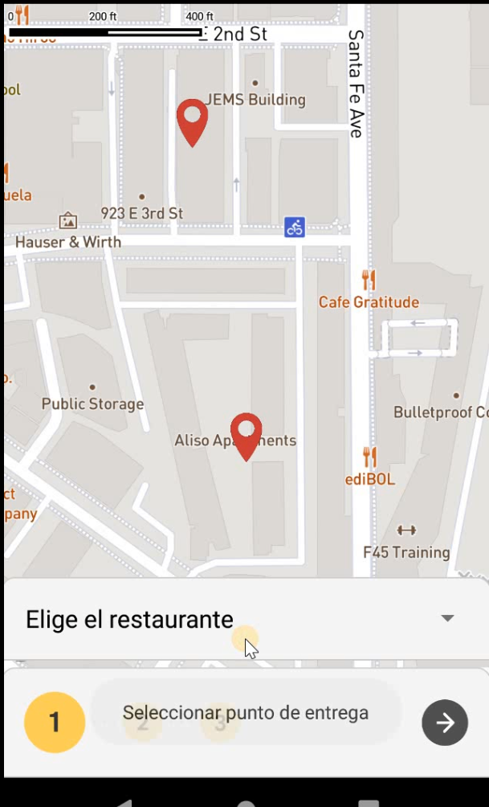
  </a>  

  <a href="assets/img/urban_lunch_informe.PNG" target="_blank">
    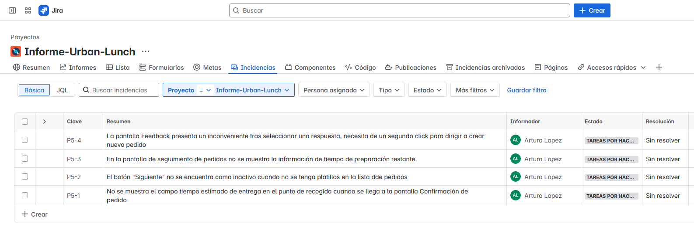
  </a>  

  <a href="assets/img/urban_lunch_informe_detalle.PNG" target="_blank">
    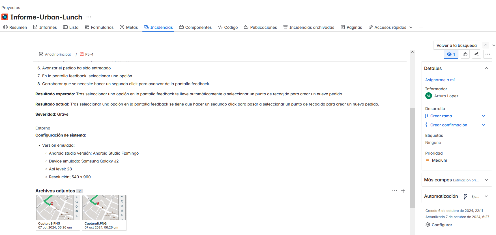
  </a>  

---

## 🛒 Urban.Grocers – Aplicación web para comprar comestibles
**Descripción:** Corregir

**Resultados:**
- Ejecuté pruebas funcionales y de regresión en APIs usando **Postman**.
- Analicé la documentación técnica (**Apidoc**) para comprender lógica de negocio.
- Diseñé **70 casos de prueba**, identificando y reportando **30 errores en JIRA**.
- Validé endpoints REST (GET, POST, PUT, DELETE), incluyendo estructura de JSON y respuestas esperadas.

**Aptitudes:**

**Enlace:** [Repositorio GitHub](https://github.com/ArturoLopMan/urban-lunch)  #corregir

**Capturas del proyecto:**  

  <a href="assets/img/urban_grocer.PNG" target="_blank">
    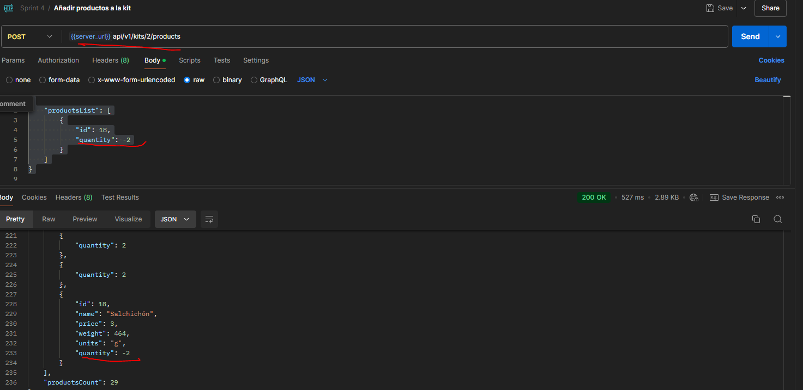
  </a>  

  <a href="assets/img/urban_grocer_informe.PNG" target="_blank">
    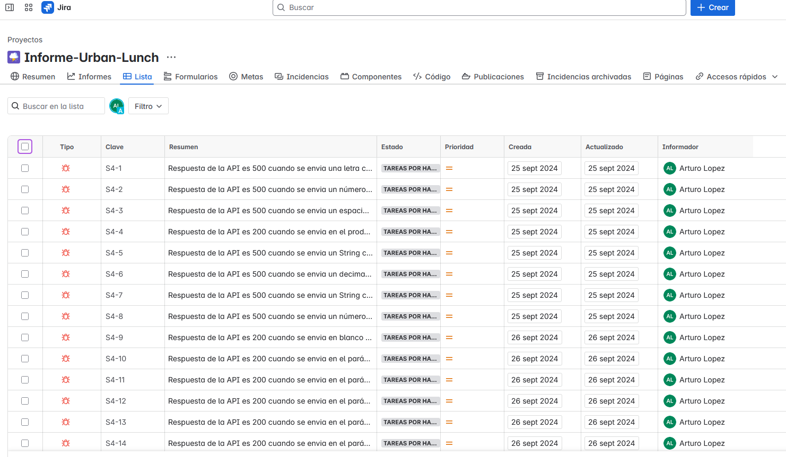
  </a>  

---

## 🚕 Urban.Routes – Aplicación web para reserva de taxis
**Descripción:** Corregir

**Resultados:**
- Ejecuté **pruebas funcionales y de regresión** en Chrome y Firefox.
- Diseñé **26 casos de prueba**, reportando **19 errores** en JIRA.
- Validé la funcionalidad de “Método de pago” y “Agregar tarjeta”, documentando **8 errores**.

**Aptitudes:**

**Enlace:** [Repositorio GitHub](https://github.com/ArturoLopMan/urban-lunch)  #corregir

**Capturas del proyecto:**  

  <a href="assets/img/urban_routes.PNG" target="_blank">
    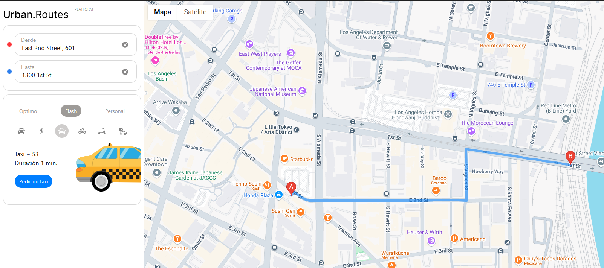
  </a>  

  <a href="assets/img/urban_routes_informe.PNG" target="_blank">
    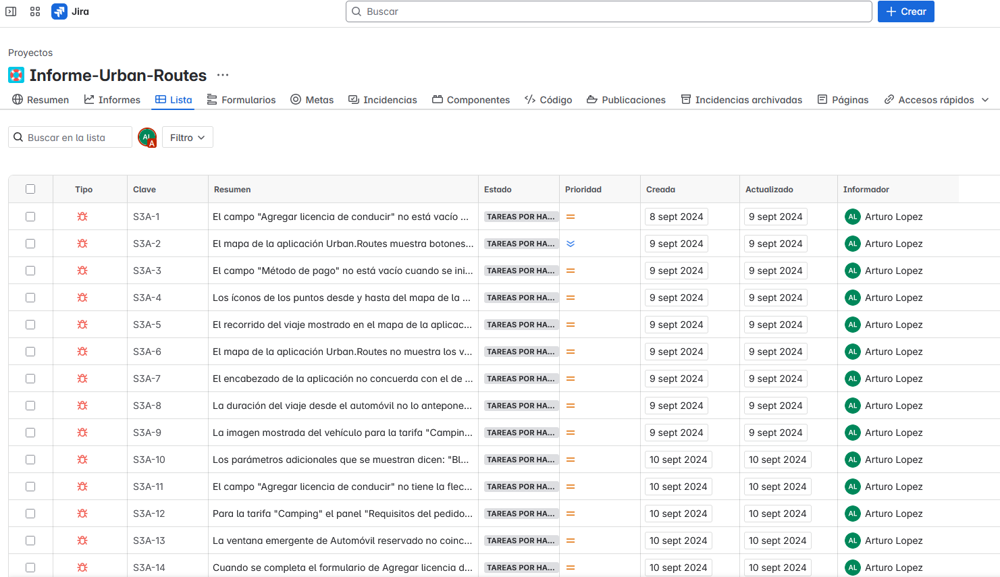
  </a>  

---

### **Proyecto Referencial 1**
**Descripción:** Ejemplo de proyecto web para prueba funcional y regresión.

**Resultados:**
- Ejecuté **pruebas funcionales y de regresión** en Chrome y Firefox.
- Diseñé **26 casos de prueba**, reportando **19 errores** en JIRA.
- Validé la funcionalidad de “Método de pago” y “Agregar tarjeta”, documentando **8 errores**.

**Aptitudes:**

**Enlace:** [Repositorio GitHub](https://github.com/tu-repo-ejemplo)  

**Capturas del proyecto:**  
Haz clic en las imágenes para ampliarlas. Cierra el zoom haciendo clic en el botón negro "Cerrar".

    

---

### **Proyecto Referencial 2**
**Descripción:** Ejemplo de plataforma API con pruebas automatizadas y reporte de errores.  

**Resultados:**
- Ejecuté **pruebas funcionales y de regresión** en Chrome y Firefox.
- Diseñé **26 casos de prueba**, reportando **19 errores** en JIRA.
- Validé la funcionalidad de “Método de pago” y “Agregar tarjeta”, documentando **8 errores**.

**Aptitudes:**

**Enlace:** [Repositorio GitHub](https://github.com/tu-repo-ejemplo)  

**Capturas del proyecto:**  

    

---

## 📄 CV Profesional

---

## 📬 ¿Hablemos?

Estoy abierto a oportunidades donde pueda aplicar mis habilidades en **QA manual o automatizado**, diseño de pruebas y documentación.  
🌐 Puedes contactarme a través de:  
- ✉️ **Email:** [alopezm41094@gmail.com](mailto:alopezm41094@gmail.com)  
- 💼 **LinkedIn:** [Arturo López - QA Engineer](https://linkedin.com/in/arturo-lopez-qa)

✨ ¡Gracias por visitar mi portafolio!
